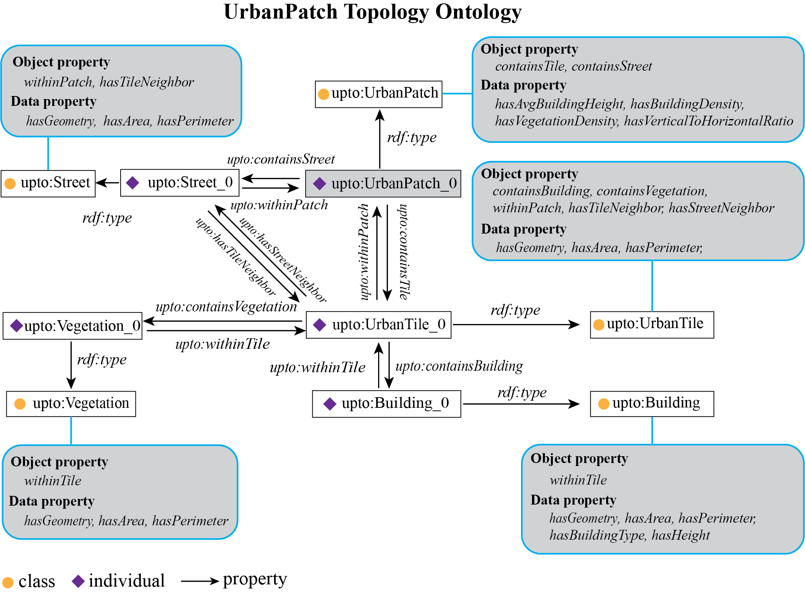
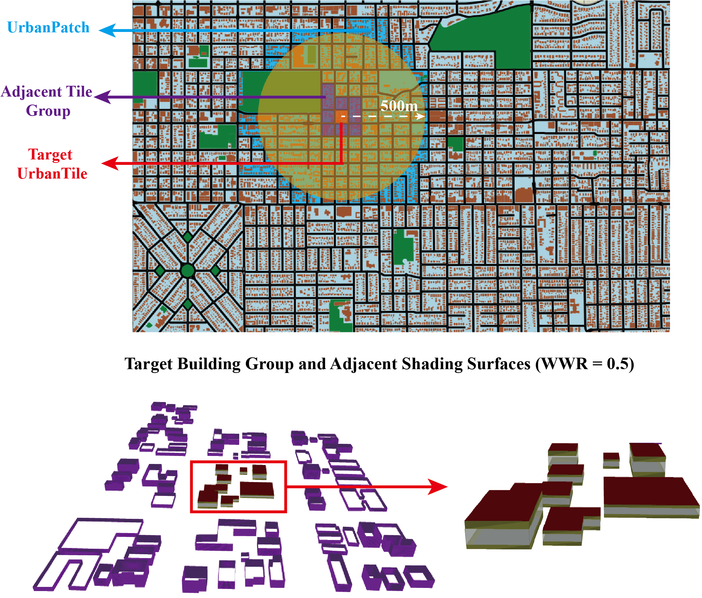

# UrbanPatch Topology Ontology (UPTO)

This repo provides  four code samples to edit or use UPTO-based multi-city digitized building models dataset.

 UrbanPatch Topology Ontology

    

    

 

Physical objects to be considered in a target UrbanTile simulation

  
 ## Code samples
  
  * `ConPatchForTile.py`: construct UrbanPatch individuals for UrbanTile objects when changing the receptive radius.
  * `ConPatchForBuilding.py`: construct UrbanPatch individuals for Building objects for a given receptive radius.
  * `GenMicroclimate.py`: generate the UrbanTile-scale microclimate.
  * `ConPatchForBuilding.py`: generate UrbanTile-scale EnergyPlus IDF file.

## Main dependencies 
[RDFLib](https://pypi.org/project/rdflib/) 
[Geomeppy](https://pypi.org/project/geomeppy/) 
[UWG](https://pypi.org/project/uwg/) 
[OSMnx](https://pypi.org/project/osmnx/) 
[OSMsc](https://pypi.org/project/osmsc/) 

## Dataset
A dataset of 30 major cities in the United States based on the UPTO structure. 
Available from [FigShare](https://doi.org/10.6084/m9.figshare.20799637.v1), where each city are saved in a separate TTL (Turtle Syntax) file. 

